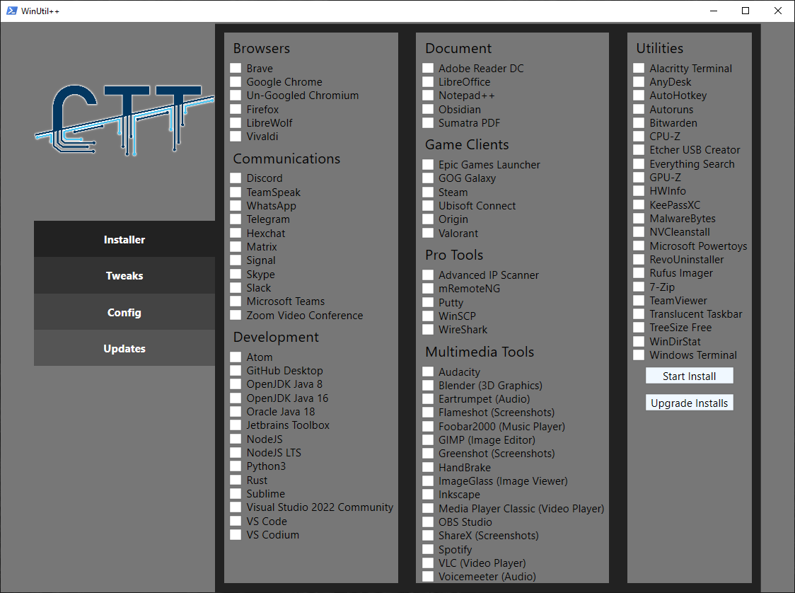
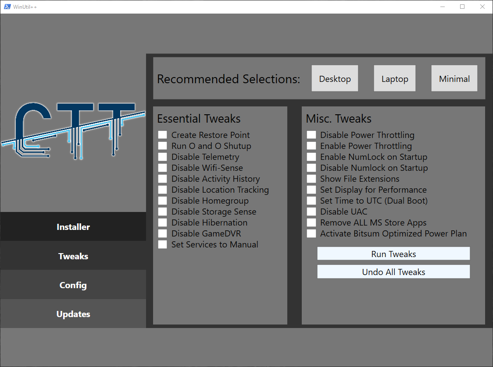
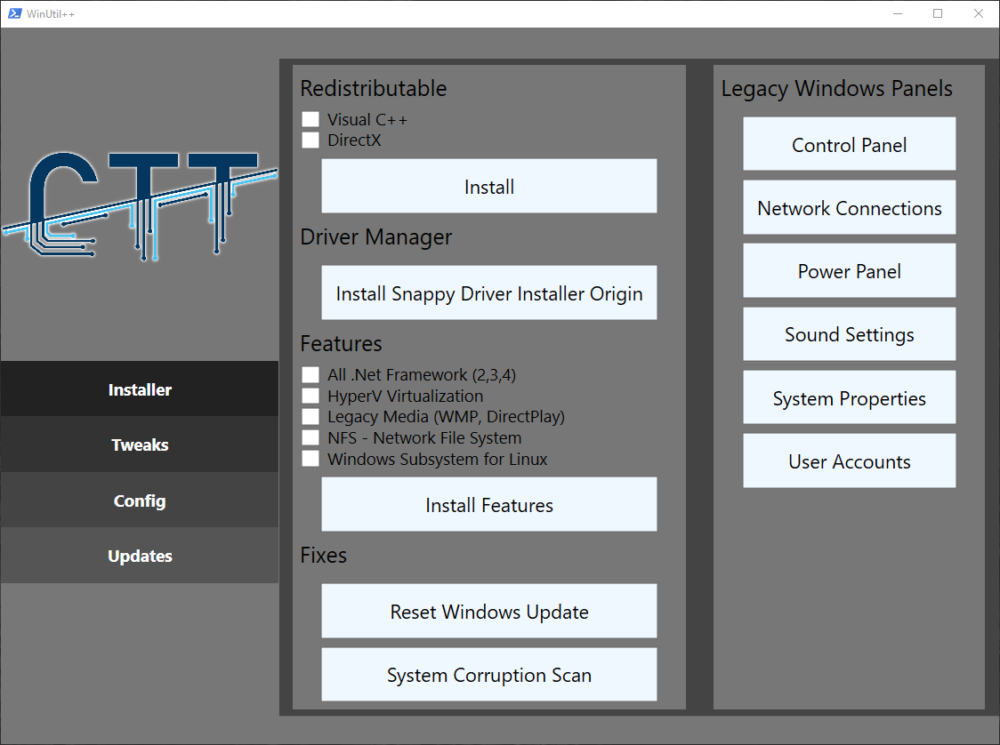
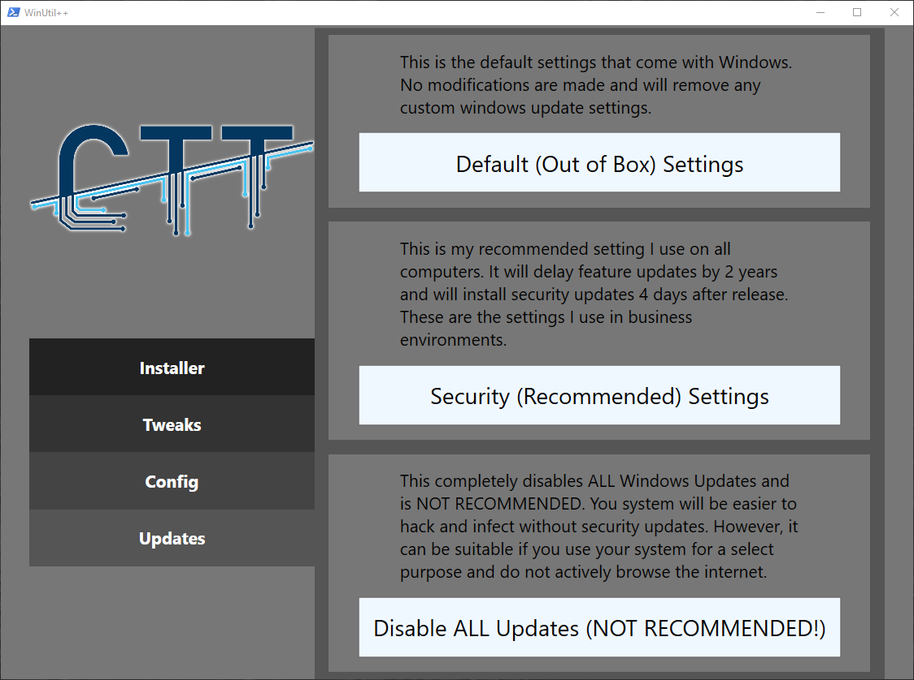

# WinUtil++

This is a FORK of [ChrisTitusTech/winutil](https://github.com/ChrisTitusTech/winutil). I have modified it and added some features, tweaks, packages etc. Latest changes from *CTT's winutil* will be pushed here.

***This utility is mainly focused on Optimizing your PC/Laptop for GAMING!***

## Screenshots










## How to Run

It is advisable to disable antivirus before running this, to prevent any irrelevant issue.

**Launch Command:**

```
iwr -useb https://bit.ly/winutilpp | iex
```

## Overview

- **Installer**
  - Installs all selected programs
- **Tweaks**
  - Optimizes windows and reduces running processes
- **Config**
  - Quick configurations for Windows Installs
- **Updates**
  - Fixes the default windows update scheme

## Issues

If you have any issues with the script please submit them to Issues tab here on GitHub and fill out the template so I can fix any bugs or make feature requests.

## Changelog

### `1.4`

> - **Added option to delete temp files**
>
> - **Added TwinkleTray program to Installer**

### `1.3`

> - **Added General Optimization Tweaks**
>
> - **Some visual changes**

### `1.2`

> - **Added Bitsum Optimized Power Plan**
>
> - **Added Timer Resolution Tweaks**

### `1.1`

> - **Modified ooshutup10.cfg**
> 
> - **Fixed GameDVR tweaks**
> 
> - **Disabled Gamebar Presence Writer to stop stuttering in games**

### `1.0`

> - **Added new programs to Installer**
>   - WhatsApp
>   - Telegram
>   - TeamSpeak
>   - Ubisoft Connect
>   - Origin
>   - Valorant
>   - Autoruns
>   
> - **Added redistributable packages to Config**
>   - Visual C++
>   - DirectX
>   
> - **Added driver installer to Config**
>   - Snappy Driver Installer Origin

